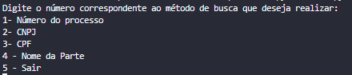
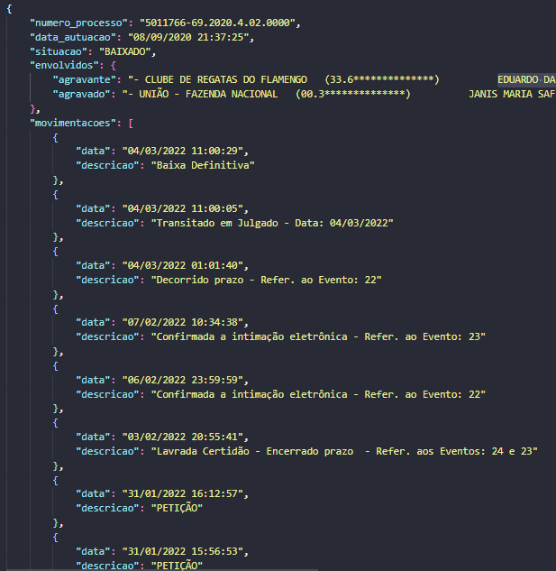

# Web Crawler para o TRF 2 Região

## Projeto

### Pré-Requisitos

Para executar o projeto é necessário ter o Python a partir da versão 3.10. A sintaxe "match" foi implementada a partir dessa versão.

Caso não tenha em sua máquina pode instalar [aqui](https://www.python.org/downloads/)


### Execução
Com o python instalado, certifique-se de instalar as bibliotecas "requests" e "beautifulsoap"

Os comandos abaixo instala o arquivo desejado: 

```
pip install requests
pip install beautifulsoup4
```

Tendo a versão certa do Python e as bibliotecas instaladas, é só executar o programa

```
python main.py
```
A foto abaixo demonstra a execução do programa



### Funcionalidades

- [X] Busca e geração de um relatório em JSON por **Número de Processo**, com reconhecimento de caracteres especiais(Ex: à, é, ç, ã).
- [ ] Busca e geração de um relatório em JSON por **CNPJ**, com reconhecimento de caracteres especiais(Ex: à, é, ç, ã).
- [ ] Busca e geração de um relatório em JSON por **CPF**, com reconhecimento de caracteres especiais(Ex: à, é, ç, ã).
- [ ] Busca e geração de um relatório em JSON por **Nome da Parte**, com reconhecimento de caracteres especiais(Ex: à, é, ç, ã).

Obs: As checkbox que não estão marcadas estão em andamento

### Abordagem de implementação

Decidi abordar o projeto com uma programação funcional, ainda mais seguindo um padrão que permite separar meu código em partes e por consequência evoluí-lo para colocar como um serviço em uma aplicação.

Notei que na busca por número de processo, é feito um POST passando o número do processo como uma Query parameter e assim resolvi fazer o crawler diretamente na página referente ao processo, com a ajuda da biblioteca requests para poder fazer um GET no processo desejado e com essa premissa, decidi seguir assim com as demais funcionalidades sem precisar fazer uma automação que abrisse o site preenchendo os dados nele.

### Resultados

#### Consulta por Número de Processo: Formato do JSON gerado.

- [X] Tipos dos dados correspondentes ao que foi solicitado




### Dificuldades Encontradas

- Me dediquei primeiramente para entender a biblioteca beautifulsoap e o que encontrei de dificuldade foi poder fazer o "crawling" nas tabelas. O site não diferencia as tabelas que estão na página, contendo os mesmos atributos nas tags HTML de tabela.

- Foi um pouco trabalhoso iterar em cada Table Rows (tr) para pegar Table Datas (td) específicos.

- Meu tempo de dedicação a esse desafio se resumiu em menos de 6 horas e foi somente a partir de 12h do dia 22/06/2023. Assim que peguei o jeito com a funcionalidade de busca por número de processo o restante seria fácil e rápido, se os outros tipos de consulta seguissem a mesma forma que por número de processo.

- Falta de uma tipagem. Estou acostumado com projetos em Typescript e estudos com C/C++ há cerca de 3 anos, além de um rápido estudo com a sintaxe do Python, nada que  a documentação aberta ao lado não ajudasse para economizar tempo

### Próximos Passos

- Estudar a estratégia de consulta processual para os outros tipos.

- Identificar os parâmetros passados nas requisições POST para receber a consulta processual de cada tipo.

- Planejar os casos para conseguir fazer requests GET diretamente na página.

- Escrever o código para cada caso de busca que faltou.
